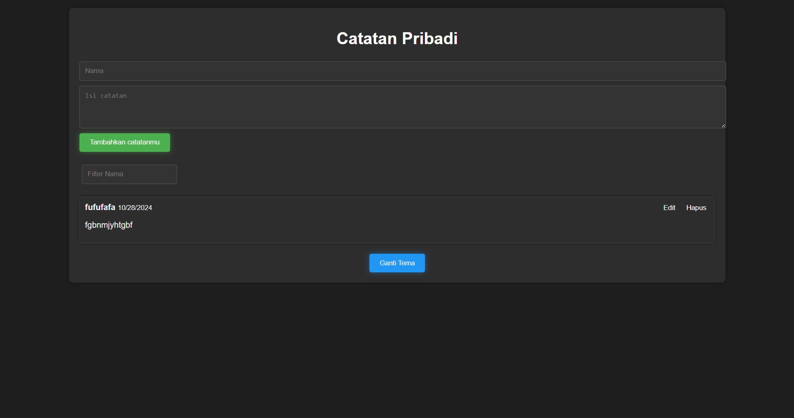

# Simple Notes Website (Indonesian Version)

**Catatan Pribadi** is a simple yet elegant personal note-taking web application built with **HTML**, **CSS**, and **JavaScript**. This website allows you to securely write, store, and manage your personal notes in a clean, user-friendly interface. Whether you need to jot down quick thoughts, track tasks, or keep detailed notes, **Catatan Pribadi** is designed to help you stay organized.

---

## Features
- **User-Friendly Interface**: Clean, minimalistic design focused on usability.
- **Note Management**: Easily create, edit, and delete personal notes.
- **Local Storage**: Notes are saved locally in your browser, ensuring your data stays safe even after closing the page.
- **Responsive Design**: Fully responsive layout, optimized for both mobile and desktop viewing.
- **Dark Mode**: Toggle between light and dark themes for a personalized experience.
  
---

## Live Preview
You can access the live version of the website here:  
[Catatan Pribadi - Personal Notes](https://rexzea.github.io/Catatan-Pribadi/)

---

## Technologies Used
- **HTML5**: Provides the structure for the note-taking application.
- **CSS3**: Used for styling, including responsive layout and theme switching (light/dark mode).
- **JavaScript**: Handles note creation, editing, deletion, and local storage functionality.

---

## Screenshot


---

## How to Use
1. Clone the repository to your local machine:
   ```bash
   https://github.com/rexzea/Catatan-Pribadi.git
